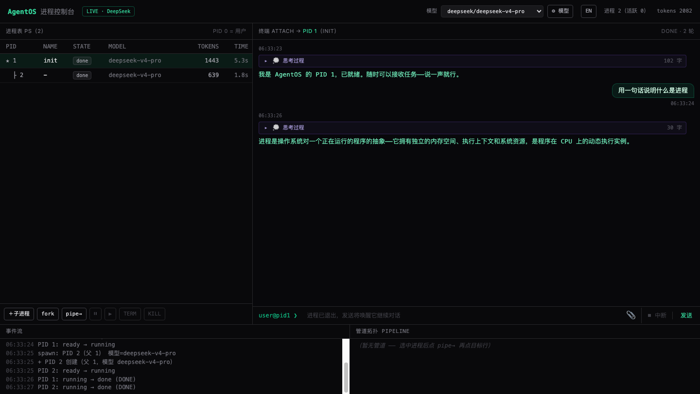
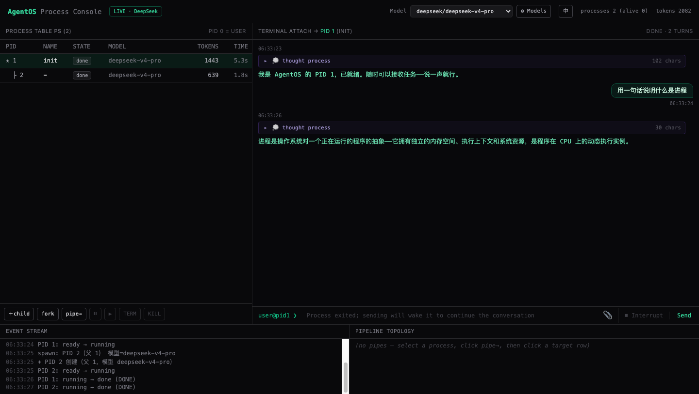

# AgentOS

**[English](README.md) | [中文](README.zh-CN.md)**

> Every agent is a process. AgentOS maps the full OS process model onto an agent runtime.

A multi-agent runtime in Node.js + TypeScript: a unified `Process` abstraction (main agent, sub-agents, and the user are all processes), blocking/async execution, concurrency, fork (COW), semaphore synchronization, signals, pipes, recursive spawn, model-parameterized launch, checkpoints, supervisors, deadlock detection, worker_threads isolation, SQLite session persistence, streaming output, user interrupt (EINTR), multimodal input, multi-provider model management, a REST + SSE live server, and a bilingual React console.



## Features

- **Full process model**: init/spawn/fork/join/exec, signals (SIGTERM/SIGKILL/SIGSTOP/SIGCONT/SIGCHLD), tree-chained budgets (rlimit), process introspection (ps/readOutput/tap)
- **IPC**: pipes (stream/batch/tool modes, backpressure + EPIPE), semaphores/mutexes/barriers with wait-for deadlock detection, shared blackboard (CAS KV)
- **Robustness**: checkpoint/restore, supervisors (one-for-one / one-for-all), worker_threads isolation, SQLite session persistence (resume across runtime instances)
- **Interaction**: streaming output (frames merged by chunk id), thinking captured on the record, interrupt-and-continue (EINTR → ON_INBOX), image multimodal injection
- **Multi-provider models**: OpenAI-compatible / Anthropic Messages API / DeepSeek providers, runtime-dynamic registration with per-model routing; register/remove providers and switch the default model from the console
- **Visual console**: React process console (process table, terminal, event stream, pipeline topology) with one-click Chinese/English switching; a zero-dependency CDP e2e suite (20 tests) guards UI behavior

## Quick Start

```bash
npm install
npm test              # all kernel unit + integration tests (MockLLM, no API key needed)
npm run test:live     # DeepSeek real-API smoke tests (needs DEEPSEEK_API_KEY in .env)
npm run typecheck
npm run lint          # ESLint
npm run format        # Prettier
npm run server        # live server (REST + SSE, default :8787, needs DEEPSEEK_API_KEY)
```

`.env`:

```
DEEPSEEK_API_KEY=sk-...
DEEPSEEK_BASE_URL=https://api.deepseek.com
```

## Up and Running in 60 Seconds

```ts
import { AgentRuntime, DeepSeekProvider } from './src/index';

const rt = new AgentRuntime({
  providers: [new DeepSeekProvider({ apiKey: process.env.DEEPSEEK_API_KEY! })],
  defaults: { model: { model: 'deepseek-v4-pro', temperature: 0.7 } },
  models: { pro: 'deepseek-v4-pro', flash: 'deepseek-v4-flash' }, // aliases
  budget: { tokens: 500_000 }, // global budget (one of the fork-bomb gates)
  maxDepth: 4,
});

// PID 1: the init process (no privileges, just the default attach point)
const init = rt.init({ task: 'Research agent runtime design', model: { model: 'pro' } });

// Async spawn: model and inference params can be overridden
const child = init.spawn({ task: 'Subtask: gather references', model: { model: 'flash', maxTokens: 2000 } });

// Blocking wait (or spawn({ mode: 'blocking' }))
const result = await child.join({ timeoutMs: 60_000 });
console.log(result.output, result.usage);

// The user (PID 0) interacts with any process (images OK, multimodal)
rt.user.attach(init.pid);
await rt.user.send(undefined, 'One more thing: focus on the process model', { priority: 'high' });
await rt.user.send(child.pid, 'How would you critique the architecture in this image?', { images: [dataUrl] });

// Streaming output: frames of the same message share chunk.id; final frame has done=true
child.stdout.tap((c) => c.id && process.stdout.write((c.data as { text: string }).text));

// Interrupt (Codex Esc semantics): stop current generation, keep partial output, go ON_INBOX
child.interrupt();

// fork: COW-copy the context; two branches explore independently
const a = init.fork('take the conservative path');
const b = init.fork('take the aggressive path');

// Pipe: one process's stdout flows into another's stdin
rt.pipe(a.pid, b.pid, { mode: 'stream' });

// Semaphore / mutex / barrier (with wait-for deadlock detection)
const sem = rt.semaphore(3);
await sem.acquire(init.pid);
sem.release(init.pid);

// Signals
rt.signal(child.pid, 'SIGTERM'); // graceful exit at a step boundary
rt.signal(init.pid, 'SIGKILL'); // force-kill the whole subtree (cascading)

// Introspection
console.log(rt.ps()); // process tree snapshot
console.log(rt.readOutput(init.pid, a.pid));

// checkpoint / restore
const snap = rt.checkpoint();
// rt2.restore(snap) -> resumes with SIGCONT
```

## Multi-Provider Models & Model Management

Three built-in providers: `OpenAIProvider` (generic OpenAI Chat Completions protocol — works with OpenAI / Moonshot / vLLM / Ollama etc.), `AnthropicProvider` (Messages API, SSE streaming), and `DeepSeekProvider` (with reasoning support). Every process can pick its own `provider` + `model`:

```ts
import { AgentRuntime, OpenAIProvider, AnthropicProvider, DeepSeekProvider } from './src/index';

const rt = new AgentRuntime({
  providers: [
    new OpenAIProvider({ apiKey: process.env.OPENAI_API_KEY! }),
    new AnthropicProvider({ apiKey: process.env.ANTHROPIC_API_KEY! }),
    new DeepSeekProvider({ apiKey: process.env.DEEPSEEK_API_KEY! }),
  ],
});

// Register a provider at runtime and bind its model list (resolveModel routes by model id)
rt.registerProvider(new OpenAIProvider({ name: 'grok', apiKey: '...', baseUrl: 'https://api.x.ai/v1' }), {
  models: ['grok-3'],
});
rt.setDefaultModel('grok-3'); // subsequent spawns without an explicit model use this

// OpenAI for planning
const planner = rt.init({ task: '...', model: { model: 'gpt-4o', provider: 'openai' } });
// DeepSeek for execution
const executor = planner.spawn({
  task: '...',
  model: { model: 'deepseek-v4-pro', provider: 'deepseek' },
});
```

## Session Persistence (SQLite)

Mirrors opencode's `session/message/part` three-table layout, plus a `process` table for the process-tree topology. Resume works across runtime instances — process tree state, conversation context, and output streams survive restarts.

```ts
import { AgentRuntime, SessionStore } from './src/index';

const store = new SessionStore('./agentos.db');
const rt = new AgentRuntime({ providers: [...], store });

// Create a session; all subsequent processes are persisted automatically
const sid = rt.attachPersistence({ title: 'research session' });

// ... run the process tree ...

// Resume in another runtime: topology + context + budgets
// Tool functions are not serializable; re-bind them by name via toolRegistry
const rt2 = new AgentRuntime({ providers: [...], store });
rt2.resume(sid, { toolRegistry: new Map([['my_tool', myTool]]) });
```

Schema (WAL mode):

| Table     | Semantics                                       | Alignment        |
| --------- | ----------------------------------------------- | ---------------- |
| `session` | One runtime session (holds the whole tree)      | opencode session |
| `process` | Process-tree topology and state (AgentOS-specific) | —             |
| `message` | Conversation-context ChatMessage                | opencode message |
| `part`    | Output-stream OutputChunk                       | opencode part    |

## Process Model Cheat Sheet

| OS                              | AgentOS                                                                              |
| ------------------------------- | ------------------------------------------------------------------------------------ |
| init (PID 1)                    | Main agent, an unprivileged root process                                             |
| terminal (PID 0)                | The user; `attach` opens a channel to a target process                               |
| spawn / exec                    | `spawn()` / `exec()` (reuse a PID for a new task)                                    |
| fork()                          | `fork()` COW context branching                                                       |
| wait()                          | `join()` reaps the ExitResult                                                        |
| rlimit                          | `Budget` tree chain: tokens/turns/wallMs deducted along the tree                     |
| SIGTERM/SIGKILL/SIGSTOP/SIGCONT | Same-named signals; SIGCHLD notifies the parent                                      |
| Ctrl+C / EINTR                  | `interrupt()` stops generation: partial output recorded, marker injected, ON_INBOX   |
| semaphores/mutexes/barriers     | `Semaphore` / `Mutex` / `Barrier` + wait-for deadlock detection                      |
| pipe                            | `pipe(a,b)` in stream/batch/tool modes, backpressure + EPIPE                         |
| /proc                           | `ps()` / `descendants()` / `readOutput()` / `tap()`                                  |
| checkpoint/restore              | `checkpoint()` / `restore()`                                                         |
| supervisor (OTP)                | one-for-one / one-for-all + maxRestarts                                              |
| process isolation               | in-process async (default) / `isolation: 'worker'`                                   |

## Live Server & Web Console

`server/index.ts` exposes the runtime as REST + SSE for the React console under `ui/`:

```bash
DEEPSEEK_API_KEY=sk-... npm run server    # default :8787
```

| Endpoint            | Description                                                                 |
| ------------------- | --------------------------------------------------------------------------- |
| GET /api/state      | Full snapshot (ps + pipes + per-process stdout history)                     |
| GET /api/events     | SSE: state changes / output chunks pushed in real time                      |
| POST /api/spawn     | { ppid, task, name?, model?, budgetTokens? } -> { pid }                     |
| POST /api/fork      | { pid, hint? } -> { pid }                                                   |
| POST /api/signal    | { pid, sig } (SIGTERM/SIGKILL/SIGSTOP/SIGCONT)                              |
| POST /api/send      | { pid, text, images? } (user = PID 0 stdin injection; images are dataURLs)  |
| POST /api/interrupt | { pid } (interrupt current generation; process goes ON_INBOX)               |
| POST /api/pipe      | { fromPid, toPid, mode? }                                                   |

Model management (registry persisted in `server/models.json`, contains apiKeys — gitignored, do not commit):

| Endpoint                    | Description                                                                          |
| --------------------------- | ------------------------------------------------------------------------------------ |
| GET /api/models             | { providers (sanitized, no apiKey), defaultModel }                                   |
| POST /api/providers         | { name, type: openai\|anthropic, apiKey, baseUrl?, models: "a,b" }                   |
| DELETE /api/providers/:name | Remove a provider; if it owned the default model, fall back to the first remaining   |
| POST /api/default-model     | { model } switch the console default model (affects future spawns, not running ones) |

On startup, if `models.json` is missing, the server seeds a deepseek provider (pro + flash) from `DEEPSEEK_API_KEY` and writes it back.

### React Console (`ui/`)

```bash
cd ui && npm install && npm run dev     # Vite dev server
```

Two modes:

- **demo mode** (default): the AgentOS kernel runs in the browser (real process mechanics, scripted Mock brain) — open and play
- **live mode**: append `?server=http://localhost:8787` to connect to the live server with real models

Features: process table tree view (PID/PPID/state/model/tokens), terminal (attach + stdin injection + interrupt), spawn dialog, event stream, pipeline topology, **model switching & management** (top-bar dropdown for the default model; the "⚙ Models" panel registers/removes providers and sets defaults via model chips), **Chinese/English switching** (top-bar toggle, persisted in localStorage).



### UI e2e (Zero-Dependency CDP Suite)

`ui/e2e/` is a Playwright-free e2e harness: Node's built-in CDP drives the system Chrome (headless) against a fake live server (REST + SSE + model endpoints + request recording), asserting real rendered behavior end to end.

```bash
cd ui && npm run test:e2e               # 20 tests (reuses dist if present)
cd ui && npm run test:e2e -- --build    # force a rebuild first
cd ui && npm run test:e2e -- --only 18  # run tests whose filename contains 18
```

Coverage: stream dedupe/autoscroll, spawn/fork auto-attach, signal lifecycle, interrupt-resume, pipe cycle guard, action-failure visibility, SSE disconnect banner, user message echo, event-log pinning, model management & default-model propagation, language toggle, and more. Every test is mutation-verified (the implementation is deliberately broken to confirm the test fails).

Visual QA scripts (real backend + real browser, step-by-step screenshots): `node e2e/qa-visual.mjs`, `node e2e/qa-models.mjs`, `node e2e/qa-i18n.mjs`.

## Milestones & Tests

| Milestone      | Content                                                                                                                                                        | Tests                                     |
| -------------- | -------------------------------------------------------------------------------------------------------------------------------------------------------------- | ----------------------------------------- |
| MVP            | lifecycle, spawn/join, model params, budgets, signals, user interaction, introspection, tool whitelist                                                         | `tests/integration/mvp.test.ts`           |
| V2             | fork COW, sync primitives, three pipe modes, SIGCHLD, event bus, checkpoint                                                                                    | `tests/integration/v2.test.ts`            |
| V3             | deadlock detection, supervisor, blackboard, worker isolation, exec                                                                                             | `tests/integration/v3.test.ts`            |
| V4 interaction | stream frames merged by id, thinking on record, full interrupt flow (EINTR->ON_INBOX->resume), SIGKILL in ON_INBOX, image multimodal messages                  | `tests/unit/streaming.test.ts`            |
| Persistence    | SQLite session/message/part/process tables, attach/resume/flush, cross-runtime resume, tool registry re-binding                                                | `tests/integration/persistence.test.ts`   |
| Multi-provider | OpenAI/Anthropic/DeepSeek providers, runtime registry, per-model routing                                                                                       | `tests/unit/anthropic.test.ts`            |
| Smoke          | DeepSeek v4 pro/flash real conversations, mixed spawn, tool calls                                                                                              | `tests/integration/deepseek.live.test.ts` |
| Real-model E2E | no mocks: recursive spawn, three budget terminations, SIGKILL/SIGTERM, user injection, pipe echo, fork, semaphore mutual exclusion, supervisor restart, checkpoint restore, worker conversations | `tests/integration/live.e2e.test.ts` |
| Console UI     | zero-dependency CDP e2e (real Chrome, real rendering)                                                                                                          | `ui/e2e/tests/` (20 tests)                |

Current status: **116 kernel vitest tests (96 Mock-based green + 4 smoke + 16 real-model E2E; live tests skip without a key); UI e2e 20/20 green**.

## Docs

- [Product Requirements (PRD)](docs/PRD.en.md)（[中文](docs/PRD.md)）
- [Technical Design](docs/DESIGN.en.md)（[中文](docs/DESIGN.md)）

## Project Layout

```
src/
├── types.ts / errors.ts / utils.ts
├── llm/         # LLMProvider: openai (generic) / anthropic (Messages API) / deepseek / mock
├── core/        # Process (PCB+ReAct loop+streaming+interrupt) / Runtime (kernel+provider registry) / Budget (tree chain)
│                # builtin-tools (spawn_process & other syscalls) / supervisor / checkpoint / user (PID 0)
├── sync/        # Semaphore / Mutex / Barrier / WaitForGraph
├── ipc/         # StdinQueue (backpressure) / StdoutStream (ring buffer+stream merge) / Pipe / Blackboard
├── store/       # SessionStore (SQLite: session/message/part/process tables + WAL)
└── worker/      # WorkerProcess + worker-entry.mjs (self-contained mini-runtime)
server/
├── index.ts     # REST + SSE live server (backend for the console)
└── models.ts    # model provider registry (models.json persistence; contains keys, do not commit)
ui/              # React + Vite + Tailwind console (own package.json)
├── src/i18n.tsx # zh/en dictionaries + Provider (top-bar toggle, localStorage persistence)
└── e2e/         # zero-dependency CDP e2e runner + 20 tests + visual QA scripts
```

Notes: in-memory checkpoint snapshots keep tool references; JSON-serialized snapshots lose tool functions (re-register after restore). SQLite persistence works the same way — `resume` re-binds tools by name via `toolRegistry`. Processes inside a worker cannot spawn children (the mini-runtime has no kernel) and do not participate in checkpoint/persistence. `ui/src/agentos/` is a browser copy of the kernel (`node:events` via a shim, no worker_threads) used for demo mode.
